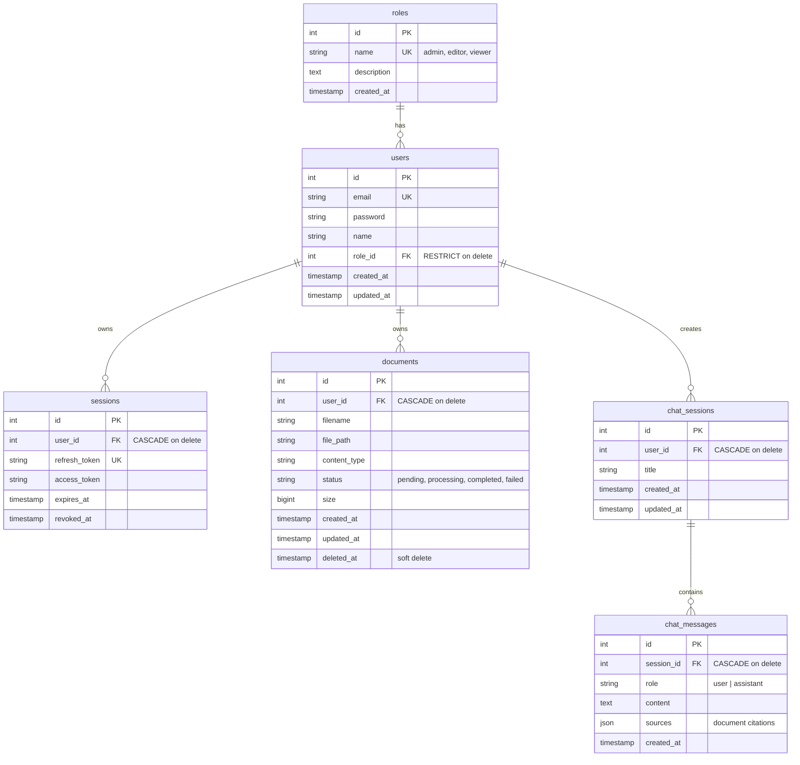

# RAGO - Database Schema Design

## Relational Diagram

## Tables Detail

### `roles`

| Column      | Type          | Constraints          | Description               |
| ----------- | ------------- | -------------------- | ------------------------- |
| `id`        | int (SERIAL)  | PK                   | Auto-increment            |
| `name`      | string (50)   | UNIQUE, NOT NULL     | `admin`, `editor`, `viewer` |
| `description` | text        |                      | Role description          |
| `created_at`| timestamp     | NOT NULL, DEFAULT NOW|                           |

Seed: `admin` (id=1), `editor` (id=2), `viewer` (id=3)

### `users`

| Column       | Type           | Constraints                       | Description          |
| ------------ | -------------- | --------------------------------- | -------------------- |
| `id`         | int (SERIAL)   | PK                                |                      |
| `email`      | string (255)   | UNIQUE, NOT NULL                  |                      |
| `password`   | string (255)   | NOT NULL                          | Bcrypt hash          |
| `name`       | string (255)   | DEFAULT ''                        |                      |
| `role_id`    | int            | FK → roles(id), RESTRICT on delete| Default: 3 (viewer)  |
| `created_at` | timestamp      | NOT NULL, DEFAULT NOW             |                      |
| `updated_at` | timestamp      | DEFAULT NOW                       |                      |

### `sessions`

| Column          | Type           | Constraints                          | Description               |
| --------------- | -------------- | ------------------------------------ | ------------------------- |
| `id`            | int (SERIAL)   | PK                                   |                           |
| `user_id`       | int            | FK → users(id), **CASCADE on delete**|                           |
| `refresh_token` | string (255)   | UNIQUE, NOT NULL                     | Session token             |
| `access_token`  | string (255)   |                                      | JWT access                |
| `expires_at`    | timestamp      | NOT NULL                             | Token expiry              |
| `revoked_at`    | timestamp NULL |                                      | Soft revoke               |

### `documents`

| Column          | Type           | Constraints                          | Description                         |
| --------------- | -------------- | ------------------------------------ | ----------------------------------- |
| `id`            | int (SERIAL)   | PK                                   |                                     |
| `user_id`       | int            | FK → users(id), **CASCADE on delete**|                                     |
| `filename`      | text           | NOT NULL                             | Original filename                   |
| `file_path`     | text           |                                      | Physical path in BlobStorage        |
| `content_type`  | text           |                                      | MIME type                           |
| `status`        | text           | DEFAULT `'pending'`                  | `pending`, `processing`, `completed`, `failed` |
| `size`          | bigint         |                                      | File size in bytes                  |
| `created_at`    | timestamp      | NOT NULL, DEFAULT NOW                |                                     |
| `updated_at`    | timestamp NULL |                                      |                                     |
| `deleted_at`    | timestamp NULL | INDEX                                | Soft delete (GORM)                  |

### `chat_sessions` *(Roadmap 1.6)*

| Column       | Type           | Constraints                          | Description          |
| ------------ | -------------- | ------------------------------------ | -------------------- |
| `id`         | int (SERIAL)   | PK                                   |                      |
| `user_id`    | int            | FK → users(id), **CASCADE on delete**|                      |
| `title`      | string (255)   |                                      | Session title        |
| `created_at` | timestamp      | NOT NULL, DEFAULT NOW                |                      |
| `updated_at` | timestamp      | DEFAULT NOW                          |                      |

### `chat_messages` *(Roadmap 1.6)*

| Column        | Type           | Constraints                               | Description              |
| ------------- | -------------- | ----------------------------------------- | ------------------------ |
| `id`          | int (SERIAL)   | PK                                        |                          |
| `session_id`  | int            | FK → chat_sessions(id), **CASCADE on delete** |                          |
| `role`        | string (20)    | NOT NULL                                  | `user` or `assistant`    |
| `content`     | text           | NOT NULL                                  | Message body             |
| `sources`     | jsonb          |                                           | Citations / document refs|
| `created_at`  | timestamp      | NOT NULL, DEFAULT NOW                     |                          |

## Constraints Summary

| Relationship              | On Delete | On Update |
| ------------------------- | --------- | --------- |
| `users.role_id` → `roles.id`       | RESTRICT  | CASCADE   |
| `sessions.user_id` → `users.id`    | CASCADE   | CASCADE   |
| `documents.user_id` → `users.id`   | CASCADE   | CASCADE   |
| `chat_sessions.user_id` → `users.id` | CASCADE | CASCADE   |
| `chat_messages.session_id` → `chat_sessions.id` | CASCADE | CASCADE |

## Roadmap Mapping

| Release   | Tables Affected                     |
| --------- | ----------------------------------- |
| **1.2**   | `roles`, `users`, `sessions`        |
| **1.3**   | `documents`                         |
| **1.4**   | `documents` (status flow)           |
| **1.6**   | `chat_sessions`, `chat_messages`    |
